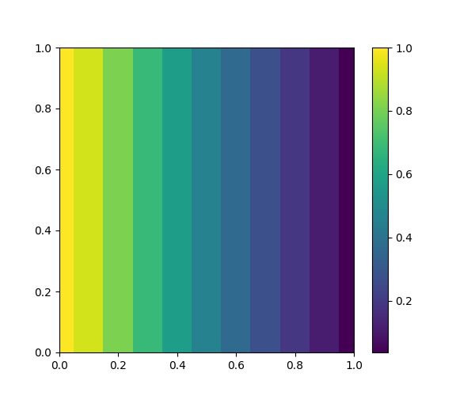

# JFVM

[](https://travis-ci.org/simulkade/JFVM.jl)

[](https://zenodo.org/badge/latestdoi/28677142)

## IMPORTANT NOTES
  + The code now works with Julia 1.0. All you need to do is to check out the master branch:
```
] add JFVM#master
```
  + 3D visualization requires calling Mayavi via PyCall. It made too many problems recently, so I have decided to disable it until I find a better solution for 3D visualization. Suggestions/PRs are very welcome.
  + I have decided to move the visualization to a new package [JFVMvis.jl](https://github.com/simulkade/JFVMvis.jl.git), that ypu need to install by:
  ```
  Pkg.clone("https://github.com/simulkade/JFVMvis.jl")
  ```

## Equations
You can solve the following PDE (or a subset of it):  


with the following boundary conditions:  


Believe it or not, the above equations describe the majority of the transport phenomena in chemical and petroleum engineering and similar fields.

## A simple finite volume tool written in Julia
This code is a Matlabesque implementation of my [Matlab finite volume tool](https://github.com/simulkade/FVTool). The code is not in its most beautiful form, but it works if you believe my words. Please remember that the code is written by a chemical/petroleum engineer. Petroleum engineers are known for being simple-minded folks and chemical engineers have only one rule: "any answer is better than no answer". You can expect to easily discretize a linear transient advection-diffusion PDE into the matrix of coefficients and RHS vectors. Domain shape is limited to rectangles, circles (or a section of a circle), cylinders, and soon spheres. The mesh can be uniform or nonuniform:
  - Cartesian (1D, 2D, 3D)
  - Cylindrical (1D, 2D, 3D)
  - Radial (2D r and \theta)

You can have the following boundary conditions or a combination of them on each boundary:
  - Dirichlet (constant value)
  - Neumann (constant flux)
  - Robin (a linear combination of the above)
  - Periodic (so funny when visualize)

It is relatively easy to use the code to solve a system of coupled linear PDE's and not too difficult to solve nonlinear PDE's.

## Installation
You need to have [matplotlib](http://matplotlib.org/) (only for visualization)

### Linux
In Ubuntu-based systems, try
```
sudo apt-get install python-matplotlib
```
Then install `JFVM` by the following commands:
```
Pkg.add("JFVM")
```

### Windows
  + open `Julia` and type
  ```
  Pkg.add("JFVM")
  ```
  + For visualization, download and install [Anaconda](http://continuum.io/downloads)  
  Run `anaconda command prompt` (as administrator) and install `matplotlib` by   
  ```
  conda install matplotlib
  ```

Please let me know if it does not work on your windows machines.

## Tutorial
I have written a short [tutorial](http://nbviewer.ipython.org/github/simulkade/JFVM.jl/blob/master/examples/jfvm_tutorial.ipynb), which will be extended gradually.

## In action
Copy and paste the following code to solve a transient diffusion equation:
```julia
using JFVM, JFVMvis
Nx = 10
Lx = 1.0
m = createMesh1D(Nx, Lx)
BC = createBC(m)
BC.left.a[:]=BC.right.a[:]=0.0
BC.left.b[:]=BC.right.b[:]=1.0
BC.left.c[:]=1.0
BC.right.c[:]=0.0
c_init = 0.0 # initial value of the variable
c_old = createCellVariable(m, 0.0, BC)
D_val = 1.0 # value of the diffusion coefficient
D_cell = createCellVariable(m, D_val) # assigned to cells
# Harmonic average
D_face = harmonicMean(D_cell)
N_steps = 20 # number of time steps
dt= sqrt(Lx^2/D_val)/N_steps # time step
M_diff = diffusionTerm(D_face) # matrix of coefficient for diffusion term
(M_bc, RHS_bc)=boundaryConditionTerm(BC) # matrix of coefficient and RHS for the BC
for i =1:5
    (M_t, RHS_t)=transientTerm(c_old, dt, 1.0)
    M=M_t-M_diff+M_bc # add all the [sparse] matrices of coefficient
    RHS=RHS_bc+RHS_t # add all the RHS's together
    c_old = solveLinearPDE(m, M, RHS) # solve the PDE
end
figure(figsize=(5,6))
visualizeCells(c_old)
colorbar()
```
Now change the 4th line to `m=createMesh2D(Nx, Nx, Lx, Lx)` and see this:


## More examples
TO DO

## IJulia notebooks
  - [Introduction](http://nbviewer.ipython.org/github/simulkade/JFVM.jl/blob/master/examples/jfvm-a-finite-volume-tool-for-julia.ipynb)
  - [tutorial](http://nbviewer.ipython.org/github/simulkade/JFVM.jl/blob/master/examples/jfvm_tutorial.ipynb)
  - [compare analytical solution of a diffusion equation with uniform and nonuniform grids](http://nbviewer.ipython.org/github/simulkade/JFVM.jl/blob/master/examples/jfvm_diffusion_analytics.ipynb)
  - [Nonlinear PDE](http://nbviewer.ipython.org/github/simulkade/JFVM.jl/blob/master/examples/solving-nonlinear-pdes-with-fvm.ipynb)
  - [Foam flow in porous media](https://github.com/simulkade/FoamFingering/blob/master/foam_flow_stars_numeric.ipynb)
  - New notebooks soon...

# How to cite
If you have used the code in your research, please cite it as
> Ali A Eftekhari. (2017, August 23). JFVM.jl: A Finite Volume Tool for Solving Advection-Diffusion Equations. Zenodo. http://doi.org/10.5281/zenodo.847056
```
@misc{ali_a_eftekhari_2017_847056,
  author       = {Ali A Eftekhari},
  title        = {{JFVM.jl: A Finite Volume Tool for Solving 
                   Advection-Diffusion Equations}},
  month        = aug,
  year         = 2017,
  doi          = {10.5281/zenodo.847056},
  url          = {https://doi.org/10.5281/zenodo.847056}
}
```
